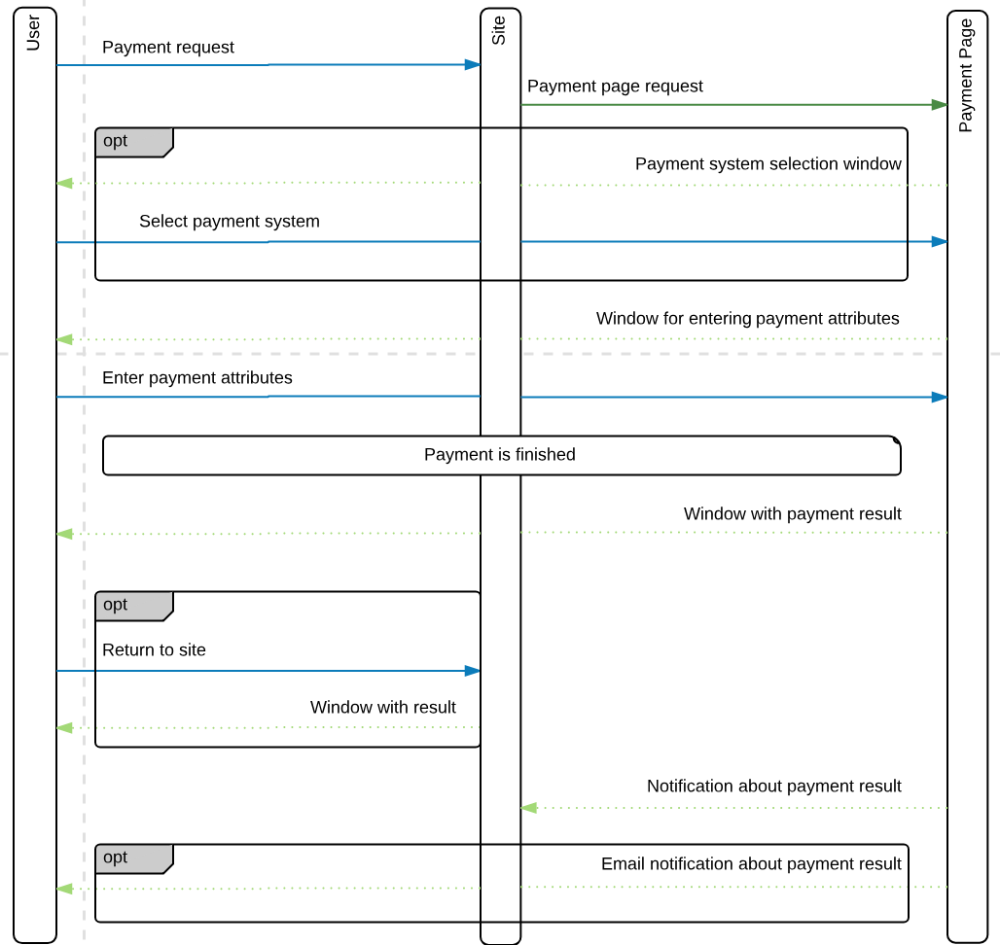

# PHP SDK

Please note that for correct SDK operating you must have at least PHP 7.0.  

## Payment flow



## Installation

Install with composer
```bash
composer require gtxpoint/paymentpage-sdk
```

### Get URL for payment

```php
$gate = new gtxpoint\Gate('secret');
$payment = new gtxpoint\Payment('11', 'some payment id');
$payment->setPaymentAmount(1000)->setPaymentCurrency('RUB');
$url = $gate->getPurchasePaymentPageUrl($baseUrl, $payment);
```

### Handle callback

You'll need to autoload this code in order to handle notifications:

```php
$gate = new gtxpoint\Gate('secret');
$callback = $gate->handleCallback($data);
```

`$data` is the JSON data received from payment system;

`$callback` is the Callback object describing properties received from payment system;
`$callback` implements these methods: 
1. `Callback::getPaymentStatus();`
    Get payment status.
2. `Callback::getPayment();`
    Get all payment data.
3. `Callback::getPaymentId();`
    Get payment ID in your system.
    
### TODO

- [x] Payment Page opening 
- [x] Notifications handling
- [ ] Direct Gate requests
- [ ] PHPDoc
